<div align="center">

<!-- HERO BANNER -->


# 🐉 KUNAAL

### AI/ML STUDENT • JAVA DEVELOPER • PYTHON DEVELOPER • DSA ENTHUSIAST


<p>


</p>

<p>


</p>

</div>

<p align="center">

</p>

---

# ⚡ THE BUILDER

> **I build, learn, solve, and experiment with technology.**

I am a **B.Tech Computer Science & Engineering student specializing in Artificial Intelligence and Machine Learning at Galgotias University**.

My technical interests include **Machine Learning, Deep Learning, NLP, Generative AI, backend development, databases, and Data Structures & Algorithms**.

I enjoy turning concepts into practical projects while continuously improving my problem-solving and software development skills.

<p align="center">

</p>

---

# 🎓 EDUCATION

<div align="center">

### 🎓 B.Tech — Computer Science & Engineering (AI/ML)

**Galgotias University**

`2024 – 2028` • **CGPA: 7.95 / 10**

<br>

### 🏫 Class XII — CBSE

**St. Mary's Convent Sr. Sec. School**

`2022 – 2023` • **82%**

<br>

### 🏫 Class X — CBSE

**St. Mary's Convent Sr. Sec. School**

`2020 – 2021` • **94%**

</div>

<p align="center">

</p>

---

# 🧠 CURRENT FOCUS

<div align="center">

| Area            | Focus                            |
| --------------- | -------------------------------- |
| 🤖 AI / ML      | Machine Learning • Deep Learning |
| 🧠 NLP          | Natural Language Processing      |
| ✨ Generative AI | Exploring Generative AI          |
| 💻 Programming  | Java • Python • C                |
| 📊 DSA          | Problem Solving & Algorithms     |
| 🗄️ Databases   | MySQL • SQL • JDBC               |
| 🌐 Web          | HTML • CSS • JavaScript          |
| 🛠️ Development | Git • GitHub • Linux             |

</div>

---

# ⚙️ TECHNOLOGY MATRIX

<div align="center">

<table width="100%">

<tr>

<td width="50%" valign="top" align="center">

### 🤖 AI / ML


<br><br>

`Machine Learning`
`Deep Learning`
`NLP`
`Generative AI`

</td>

<td width="50%" valign="top" align="center">

### 💻 PROGRAMMING


</td>

</tr>

<tr>

<td width="50%" valign="top" align="center">

### 🌐 WEB DEVELOPMENT


</td>

<td width="50%" valign="top" align="center">

### 🗄️ DATABASE


<br><br>

`SQL` • `JDBC` • `MySQL`

</td>

</tr>

<tr>

<td width="50%" valign="top" align="center">

### 🛠️ TOOLS


</td>

<td width="50%" valign="top" align="center">

### 📊 DATA

`Pandas` • `Matplotlib` • `CSV`

</td>

</tr>

</table>

</div>

<p align="center">

</p>

---

# 🚀 PROJECTS

<div align="center">

## 🏨 HOTEL MANAGEMENT SYSTEM

### `Java` • `MySQL` • `JDBC` • `OOP` • `Git/GitHub`

</div>

A console-based hotel management application designed to manage rooms and reservations.

**Highlights**

* 🏨 Managed **50+ rooms**
* 📋 Supported **200+ reservations**
* 🔄 Implemented the complete booking lifecycle
* 🗄️ Built CRUD operations using **JDBC + MySQL**
* ✅ Added input validation
* 🧩 Designed a normalized **4-table database schema**
* ⚡ Improved query performance through database normalization
* 🔒 Used `try-with-resources` for SQL exception handling

**Timeline:** `January 2026 – March 2026`

---

<div align="center">

## 📊 STUDENT GRADE TRACKER

### `Python` • `Pandas` • `Matplotlib` • `CSV`

</div>

A Python-based application for student performance analysis and reporting.

**Highlights**

* 📈 Automated GPA calculation
* 👨‍🎓 Processed data for **30+ students**
* 📚 Supported **5 subjects**
* 📊 Generated semester-wise performance charts
* 🐼 Used Pandas for data processing
* 📁 Integrated CSV-based data storage
* 🔎 Added subject-wise performance comparison

**Timeline:** `2024`

<p align="center">

</p>

---

# 🧩 DSA & CODING JOURNEY

<div align="center">


<br><br>

### 500+ Data Structures & Algorithms Problems

</div>

I have solved **500+ DSA problems across multiple coding platforms**, continuously improving algorithmic thinking and problem-solving skills.

### 🎯 Coding Platforms

<p align="center">

<a href="https://leetcode.com/u/Kunaal001/">

</a>

<a href="https://www.codechef.com/users/kunaal_1234">

</a>

<a href="https://codeforces.com/profile/skunaal57">

</a>

<a href="https://codolio.com/profile/Kunaal/">

</a>

</p>

<p align="center">

</p>

---

# 📡 GITHUB TELEMETRY

<div align="center">





</div>

<br>

<div align="center">


</div>

---

# 🏆 GITHUB TROPHIES

<p align="center">


</p>

---

# 📈 CONTRIBUTION GRAPH

<p align="center">



</p>

---

# 🐍 CONTRIBUTION SNAKE

<p align="center">


</p>

---

# 🏅 CERTIFICATIONS

<div align="center">

### 🟢 NVIDIA

**Fundamentals of Deep Learning — NVIDIA**

`2026`

<br>

### 🎓 Galgotias University

**Short-Term Training Program**

`2025`

</div>

<p align="center">

</p>

---

# 👥 ACTIVITIES & EXPERIENCE

* 👨‍💻 Led **backend development and database design** in 2+ group assignments.
* 🤝 Coordinated deliverables across **4-member teams**.
* 📚 Completed **5+ courses** covering Python, Machine Learning and Data Structures.
* 💻 Solved **500+ DSA problems** across multiple coding platforms.

---

# 🧠 SKILL PROFILE

<div align="center">

```text
                    KUNAAL
                       │
         ┌──────────────┼──────────────┐
         │              │              │
        AI/ML         SOFTWARE          DSA
         │              │              │
    ┌────┼────┐     ┌───┼────┐      Problem
    │    │    │     │   │    │       Solving
   ML   DL   NLP   Java Python C
    │    │    │     │   │
    └────┼────┘     └───┼────┘
         │              │
         └──────┬───────┘
                │
           DEVELOPMENT
                │
        ┌───────┼────────┐
        │       │        │
       SQL    JDBC     Git/GitHub
```

</div>

---

# 🌐 CONNECT WITH ME

<div align="center">

<a href="https://github.com/Kunaal9034">


</a>

<a href="https://www.linkedin.com/in/kunaal90/">


</a>

<a href="https://leetcode.com/u/Kunaal001/">


</a>

<a href="https://www.codechef.com/users/kunaal_1234">


</a>

<a href="https://codeforces.com/profile/skunaal57">


</a>

<a href="https://codolio.com/profile/Kunaal">


</a>

</div>

---

# 👁️ PROFILE VIEWS

<p align="center">


</p>

---

<div align="center">


### ⚡ CODE • LEARN • BUILD • REPEAT


### 🚀 Building Skills Today. Engineering Solutions Tomorrow.

</div>
